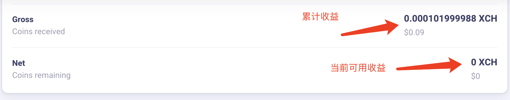
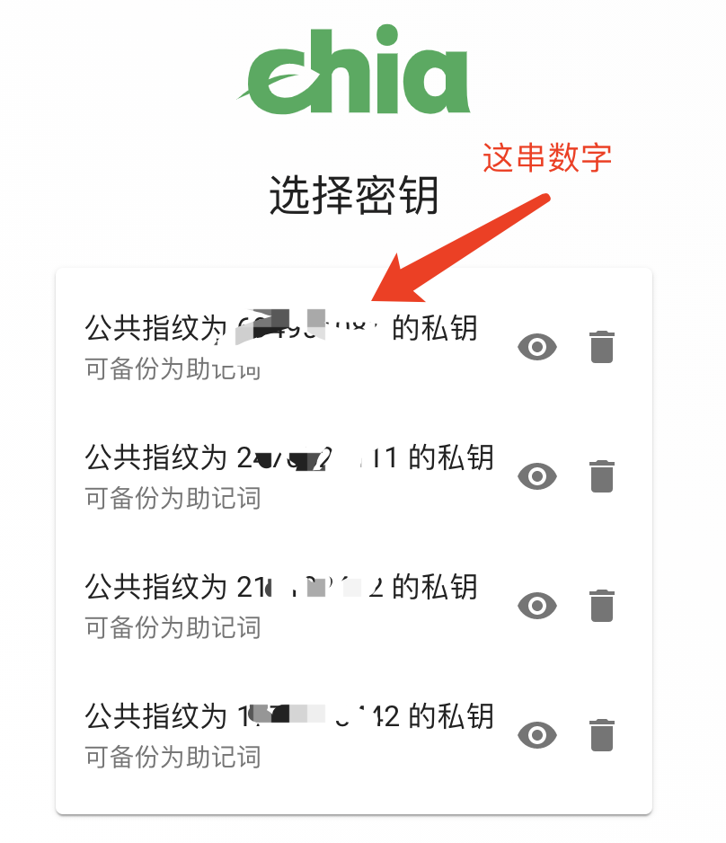

# hookpool_client_chia
Create a fair just and automatic transfer mining pool for chia  
建立一个非商业化CHIA矿池，与诸多矿友们一起愉快地挖矿。

## HookPool能提供的服务
1、收益即时分配
   当矿池参与者在矿池挖矿有爆块场景，矿池会按照贡献值进行收益分配，并直接通过区块交易转到矿工的收款钱包上。

2、无算力限制
   不管你是101G，还是101TB，我们都会按照有效算力进行收益分配，最小收益精度：1mojo(亿万分之一XCH)

3、免配置挖矿
   使用HookPool矿池操作简单，只需要在CHIA钱包的机器上打开start_pool_mining.bat，并按照提示填写收款钱包地址即可（如需恢复SOLO服务，双击clear_pool_service.bat即可）。
    
4、安全性
   HookPool仅复用官方钱包和相关配置，我们不会保存或窃取任何敏感信息，仅通过证书集群的方式进行收益绑定(后续会公开相关源码)

5、矿池钱包
  [矿池地址区块查看](https://www.chiaexplorer.com/blockchain/address/xch17g5nem3frkl4lj74lmdk9qwzqtwkmlj7ap0czacuk0jexf7hv6msm5t79p)  
  

矿池运作原理和收益分配原理 [查看](https://github.com/allenlinkme/hookpool_client_chia/blob/master/pool_detail/pool.md)  

## 关于官方矿池和双挖看法
官方矿池的源码地址：https://github.com/Chia-Network/pool-reference  

1、作为矿工出身的笔者，表示非常支持并且乐于看到官方矿池能给矿友们提供一个公平和稳定的挖矿环境，但是坐看官方矿池的代码遥遥无期。

2、官方的矿池需要矿友同步节点，而CHIA同步节点本身非常不稳定，经常断连，并且断连持续时间非常可观。

3、关于双挖，我们不建议用户双挖，但是我们也很坦诚的告诉矿友们，我们暂时没有对双挖进行限制(将来可能考虑做限制)，但是不管如何，我们不会永久封停矿友的账号，也不会侵吞矿友的收益(即时到账)。

## 进度
矿池采用邀请码机制公测中。

目前v2.7稳定版本开放公测

重要提醒：

1.想要修复官方solo与旧版本冲突的，下载后，双击运行clear_pool_service.bat

2.邀请码与钱包指纹是有绑定关系，分享给他人不能使用

3.公测期间可能会很短时间内会显示矿池0算力，这是正常的，这是我们后台修复bug然后重启服务，矿池实时计算所有在线算力，所以重启期间会有个置零操作，不影响正常挖矿

4.邀请码我们后续会在矿池主页发布申请链接，请关注我们矿池主页消息：https://hookpool.net/

5.公测期间，矿池在线的矿工会不定时收到有收益，这是真实收益，我们正在向矿池空投，测试矿池自动转账是否正常

6.如果当天看到矿池提示到账比较多收益，这是爆块收益，矿工可自行去官方钱包查看是否到账（官方钱包要同步完成才能看到收益）爆块收益会比较多(前期公测爆块后有个矿工到账1.39XCH)，请确保自己的钱包地址是否正确（钱包地址中间不要出现空格或者其他字符），以免损失收益

7.公测激活码申请渠道：[hookpool.net@gmail.com](mailto:hookpool.net@gmail.com) ，请发邮件到该邮箱地址。邮件格式如下

标题：hookpool矿池邀请码申请

内容：钱包指纹：XXX   打算加入的算力：XXX

（注意钱包指纹不要填错，我们邀请码和钱包指纹绑定，后续修改第三方收益地址没有邀请码修改不了，所以请不要把你的邀请码发给他人）

8.激活码申请，请发钱包指纹，很多人发送了钱包地址过来，钱包指纹就是chia官方钱包首页的那个公共指纹（一串数字，是钱包公钥的指纹）

9.关于自动转账的测试，目前在线80多，实际70多用户，测试收益自动转账是成功的，到账时间基本控制在几分钟之内

10.版本更新到2.7，请各位矿工升级到2.7，2.6效率太低了  到现在还没爆块

11.重要通知：

关于激活码申请，有部分矿工发了钱包地址过来，更有矿工，把他的助记词都发过来了(我们已经第一时间通知该用户，并删除我们这边的收件邮件，助记词不要发给任何人)，助记词自己保存好，别发过来，钱包指纹是官方软件首页选择钱包的那一串数字

## 空投发红包
如果有矿友支持我们，可以转入XCH到xch17g5nem3frkl4lj74lmdk9qwzqtwkmlj7ap0czacuk0jexf7hv6msm5t79p （不要超过1XCH）。

我们的矿友，都会收到相关红包。

## 关于矿池收益
我们提供统一服务器进行挖矿，为了维系服务成本，我们每次爆块转账时候会收取千分之五的手续费。
矿池钱包会留存1001mojo做为之后可能要付转账手续费做准备，其余无任何费用，如CHIA采用0手续费可长期保持一定的到账速度，将来这份收益会以红包的方式发给矿友们。

1.通过官方钱包查看收益（需要同步钱包高度，不然看不到收益）  
2.通过区块浏览器查看：https://www.chiaexplorer.com/blockchain/address/+钱包地址  
3.使用你的First wallet address的地址，我们矿池绑定矿工的是这个地址，发放收益的也是这个地址
 查看方法：
 `chia keys show`

选择对应的钱包指纹的First wallet address

## 关于转账时间
在实测中，一笔交易的节点确认大约需要30s左右。

## 公测情况
1、2021年05月27日：修复后台服务BUG，解决连接不上矿池的现象。

2、2021年05月28日：剔除非关键日志。

3、2021年05月29日：优化CHIA集群挖矿中，死循环连接矿池的问题(由于该问题的出现导致服务器遭受反射性DDOS攻击)。

4、2021年05月30日，添加邀请码机制，需要邀请码才能参与到矿池(旨在预防矿友们过度热情，瞬间带来庞大的用户群体，我们的非商业化服务器无法支撑)。

5、2021年05月31日：修复官方软件的底层通信的一些BUG，解决由守护进程死循环重连导致的高压力现象。
